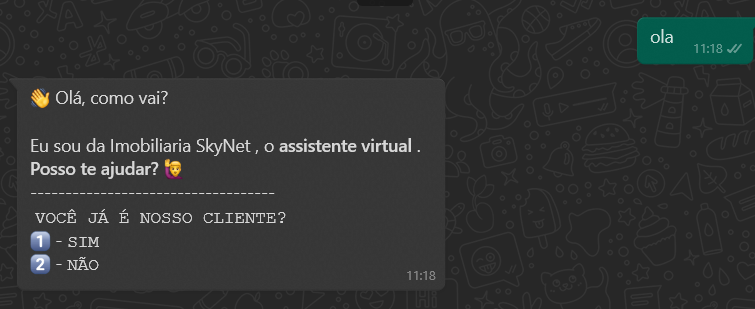
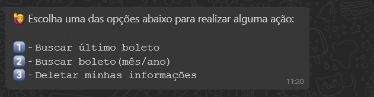
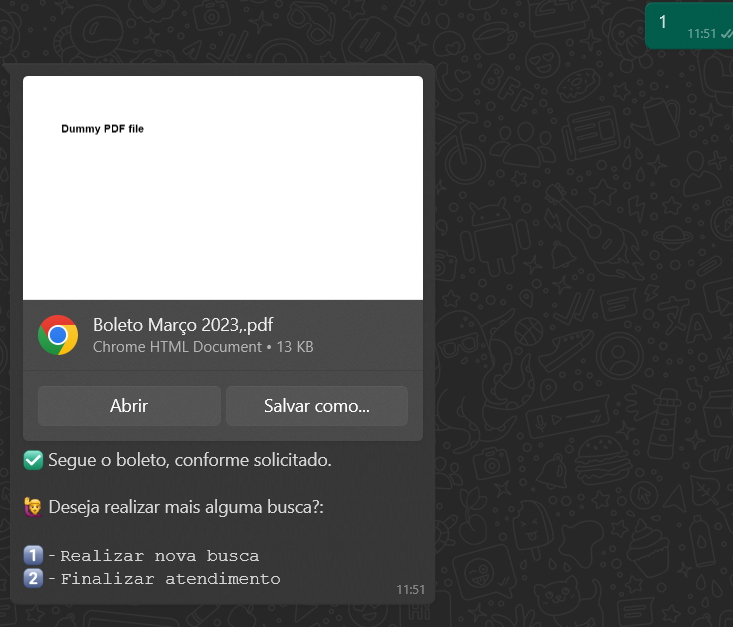
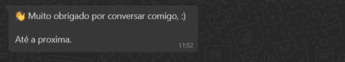
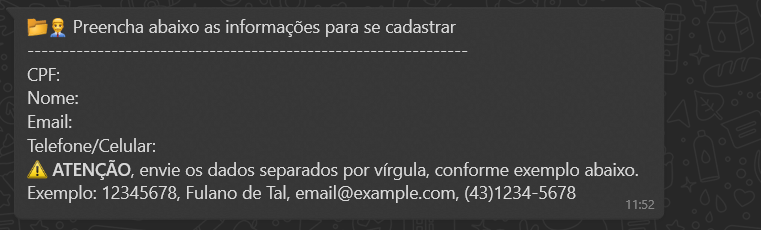

# Whatsapp Bot with VENOM-BOT

## Project description

<p align="center"></p>
<h1 align="center">
    <a href="https://nodejs.org/en/">🔗 NodeJS</a>
    <a href="https://www.npmjs.com/package/venom-bot">🧠 Venom Bot</a>
</h1>
<p align="center">🚀 Projeto criado com o intuito de auxiliar nas demandas de empresas via WhatsApp.</p>
<h1 align="center">

  <br/>
 
  <br/>
  
  <br/>
 
  <br/>

  <br/>

  <br/>
  In case of unregistered user**<br/>
  
</h1>

### 🎲 Running our application

```bash
# development
$ npm run start

# watch mode
$ npm run start:dev
```

### 🛠 Language and Tools

- [Node.js](https://nodejs.org/en/)
- [Prisma](https://www.prisma.io/docs)
- [TypeScript](https://www.typescriptlang.org/docs/)

### Autors

---

Higor Seixas<br/>
 <a href ="higor.c.seixas@gmail.com">
  </a>
  <a href="https://www.linkedin.com/in/higor-celm-seixas-27rj/" alt="Linkedin">
  </a>
   <a href="https://twitter.com/higoreixas2" alt="Twitter">
  </a>

Lenardo Lima<br/>
 <a href ="mailto:leonardorocha.limaa@gmail.com">
  </a>
  <a href="https://www.linkedin.com/in/leonardo-vinícius-r-7ba1a6118/" alt="Linkedin">
  </a>
   <a href="https://twitter.com/arochaleeo" alt="Twitter">
  </a>
